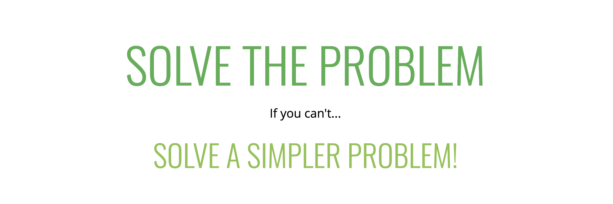

# Problem Solving Approach

### What is an Algorithm?

1. A process or set of steps to accomplish a certain task.
2. Almost everything that you do in programming involves some kind of algorithm! It's the foundation for being a successful problem solving and developer.

### Approach while solving problem

1. Devise a plan for solving problems.
2. Master common problem solving patterns.

## Problem Solving

Note: many of these strategies are adapted from George Polya, whose book How To Solve It is a great resource for anyone who wants to become a better problem solver.

1. Understand the Problem.
2. Explore Concrete Examples.
3. Break It Down.
4. Solve/Simplify.
5. Look Back and Refactor.

### Understand the Problem

1. Can I restate the problem in my own words?
2. What are the inputs that go into the problem?
3. What are the outputs that should come from the solution to the problem?
4. Can the outputs be determined from the inputs? In other words, do I have enough information to solve the problem? (You may not be able to answer this question until you set about solving the problem. That's okay; it's still worth considering the question at this early stage.)
5. How should I label the important pieces of data that are a part of the problem?

### Explore Concrete Examples

1. Coming up with examples can help you understand the problem better.
2. Examples also provide sanity checks that your eventual solution works how it should
3. Start with Simple Examples
4. Progress to More Complex Examples
5. Explore Examples with Empty Inputs
6. Explore Examples with Invalid Inputs

### Break It Down

1. Explicitly write out the steps you need to take.
2. This forces you to think about the code you'll write before you write it, and helps you catch any lingering conceptual issues or misunderstandings before you dive in and have to worry about details (e.g. language syntax) as well.
   

### Solve & Simplify

1.  Find the core difficulty in what you're trying to do.
2.  Temporarily ignore that difficulty.
3.  Write a simplified solution.
4.  Then incorporate that difficulty back in.

### Look back and Refactor

1. Can you check the result?
2. Can you derive the result differently?
3. Can you understand it at a glance?
4. Can you use the result or method for some other problem?
5. Can you improve the performance of your solution?
6. Can you think of other ways to refactor?
7. How have other people solved this problem?
